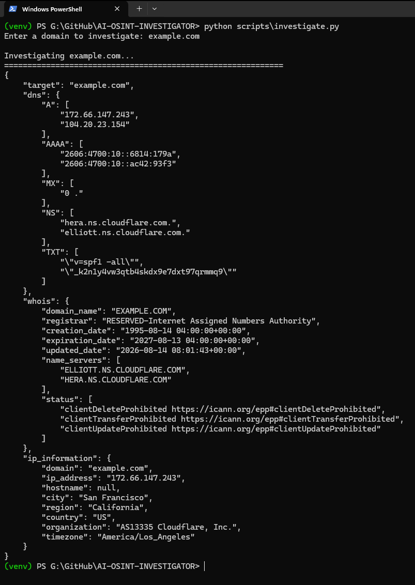
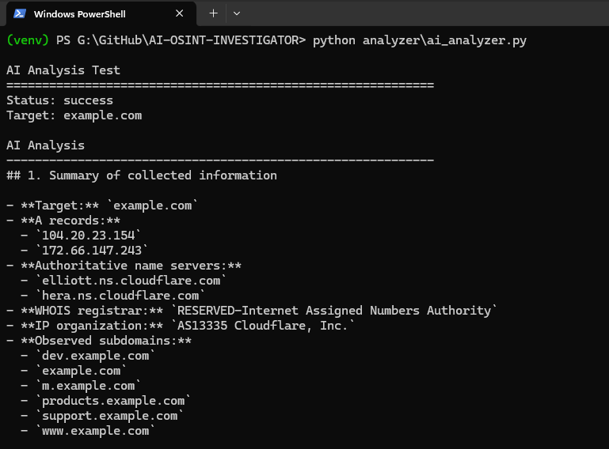
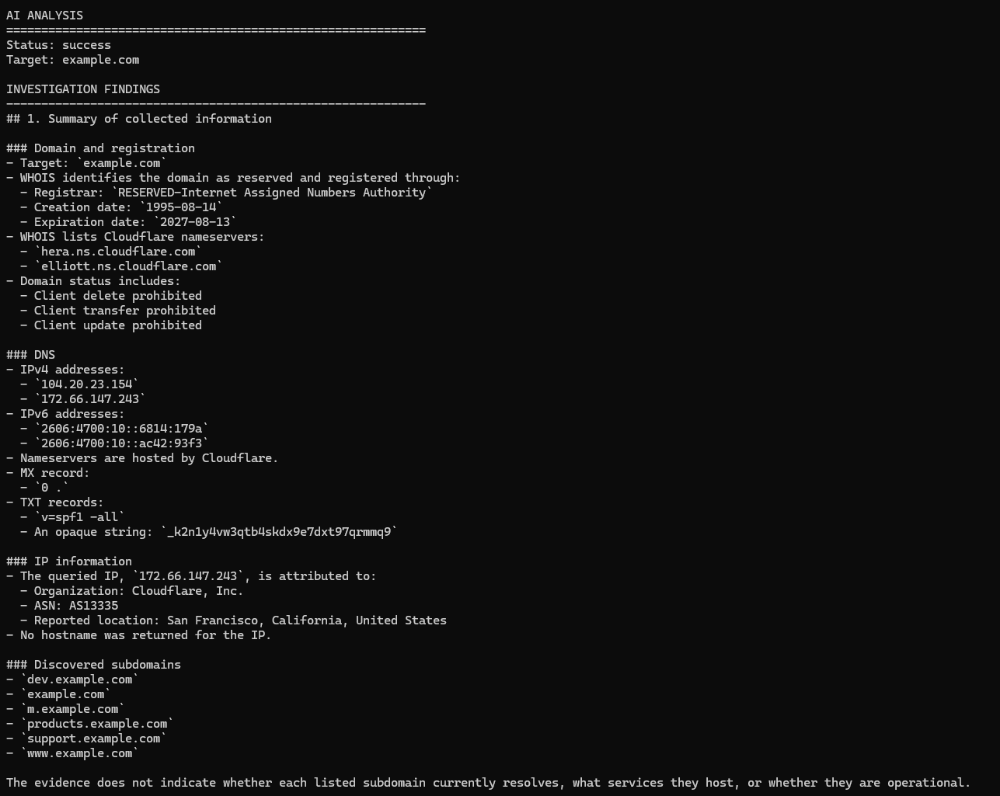
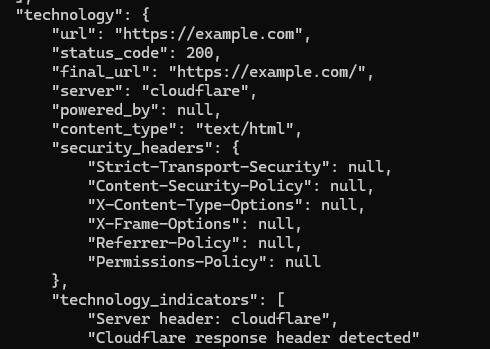
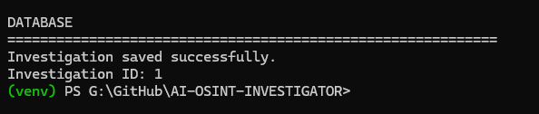
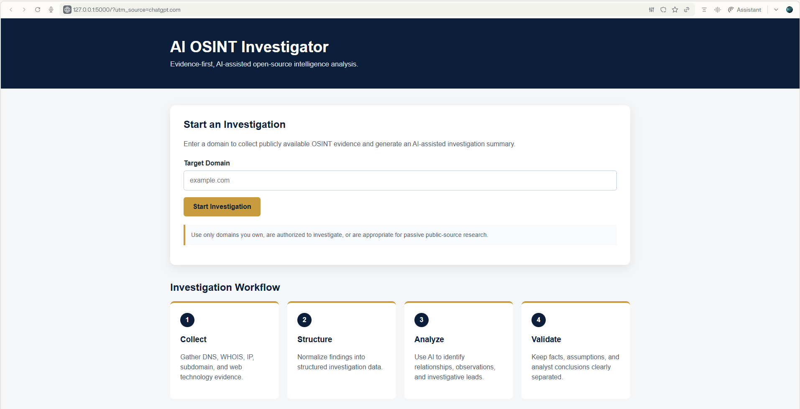
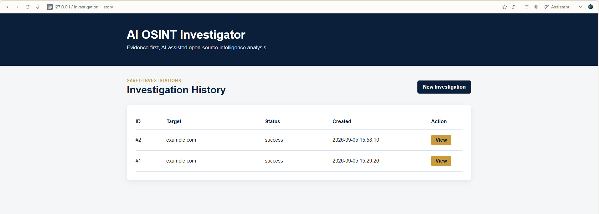

# 🔎 AI OSINT Investigator

An evidence-first, AI-assisted open-source intelligence application that collects publicly available information about a domain, structures the evidence, uses AI to assist with analysis, stores investigation results, and generates investigation reports.

> **Workflow:** Collect → Structure → Analyze → Validate → Report

---

## 📌 Project Overview

The AI OSINT Investigator was built as a hands-on cybersecurity portfolio project to demonstrate how open-source intelligence collection can be combined with AI-assisted analysis without treating AI-generated conclusions as evidence.

The application accepts a target domain and collects several categories of publicly available information, including:

- DNS records
- WHOIS information
- IP information
- Passive subdomain discoveries
- Web technology indicators
- HTTP security headers

The collected evidence is normalized into structured investigation data before being provided to an AI analysis component.

The AI is instructed to distinguish between:

- Observed facts
- Reasonable inferences
- Unknowns
- Potential risks
- Recommended investigative steps

Investigation results are stored in a local SQLite database and can be reviewed through a Flask web interface.

---

## 🎯 Project Goals

This project demonstrates practical experience with:

- Open-source intelligence collection
- Python automation
- DNS investigation
- WHOIS analysis
- IP attribution
- Passive subdomain discovery
- HTTP response analysis
- Security header analysis
- API integration
- AI-assisted cybersecurity analysis
- Prompt design
- Evidence validation
- SQLite databases
- Flask web development
- PDF report generation
- Secure API-key management
- Git and GitHub documentation

---

## 🏗️ Architecture

```text
                    ┌─────────────────────┐
                    │    Target Domain    │
                    └──────────┬──────────┘
                               │
                               ▼
                    ┌─────────────────────┐
                    │  OSINT Collection   │
                    └──────────┬──────────┘
                               │
              ┌────────────────┼────────────────┐
              │                │                │
              ▼                ▼                ▼
            DNS              WHOIS             IP
              │                │                │
              └────────┬───────┴───────┬────────┘
                       │               │
                       ▼               ▼
                  Subdomains      Web Technology
                       │               │
                       └───────┬───────┘
                               │
                               ▼
                    ┌─────────────────────┐
                    │ Structured Evidence │
                    └──────────┬──────────┘
                               │
                               ▼
                    ┌─────────────────────┐
                    │ AI-Assisted Analysis│
                    └──────────┬──────────┘
                               │
                               ▼
                    ┌─────────────────────┐
                    │ Human Validation    │
                    └──────────┬──────────┘
                               │
                     ┌─────────┴─────────┐
                     ▼                   ▼
              SQLite Database       PDF Report
                     │
                     ▼
              Flask Dashboard
```

---

## 🔄 Investigation Workflow

### 1. Collect

The application gathers publicly available evidence associated with the supplied domain.

### 2. Structure

Results from multiple collectors are normalized into a single structured investigation dataset.

### 3. Analyze

The structured evidence is submitted to an AI model using an evidence-focused analysis prompt.

### 4. Validate

AI-generated observations are treated as investigative assistance rather than verified facts. Findings should be compared against the collected evidence.

### 5. Report

Investigation data can be stored, retrieved, reviewed through the web interface, and exported into an investigation report.

---

## 🔍 OSINT Collectors

### DNS Collector

Collects common DNS record types:

- A
- AAAA
- MX
- NS
- TXT

### WHOIS Collector

Collects domain-registration information such as:

- Registrar
- Creation date
- Expiration date
- Updated date
- Name servers
- Domain status

### IP Collector

Resolves the target domain and collects public IP metadata such as:

- IP address
- Hostname
- City
- Region
- Country
- Organization
- Time zone

IP geolocation is treated as infrastructure metadata and should not be interpreted as proof of an organization's physical location.

### Passive Subdomain Collector

Uses publicly available Certificate Transparency information to identify domain and subdomain names.

The collector performs passive discovery rather than brute-force subdomain enumeration.

Certificate Transparency observations do not prove that a hostname is currently active.

### Web Technology Collector

Collects publicly observable HTTP information including:

- HTTP status
- Final URL
- Server header
- X-Powered-By header
- Content type
- Security headers
- Basic technology indicators

Security headers examined include:

- Strict-Transport-Security
- Content-Security-Policy
- X-Content-Type-Options
- X-Frame-Options
- Referrer-Policy
- Permissions-Policy

A missing header is recorded as an observation rather than automatically classified as a vulnerability.

---

## 🤖 AI-Assisted Analysis

Collected OSINT evidence is converted into a structured prompt before being sent to the AI analysis component.

The analysis is instructed to:

1. Summarize the collected evidence.
2. Identify relationships between findings.
3. Highlight observations requiring further investigation.
4. Identify potential risks only when supported by evidence.
5. Separate facts from assumptions.
6. Avoid labeling infrastructure as malicious without supporting evidence.
7. Recommend reasonable next investigative steps.

### Important Principle

**AI output is not evidence.**

The AI functions as an investigative assistant. Analyst validation remains necessary before conclusions are drawn.

---

## 🗄️ Investigation Database

Completed investigations are stored in a local SQLite database.

Stored information includes:

- Investigation ID
- Target
- Collected OSINT data
- AI analysis
- Investigation status
- Creation timestamp

Saved investigations can later be retrieved without rerunning the original collection process.

The local database is excluded from Git tracking.

---

## 🌐 Flask Web Interface

The project includes a Flask-based interface for running and reviewing investigations.

The interface provides:

- Domain investigation form
- Investigation status
- DNS evidence
- WHOIS evidence
- IP information
- Discovered subdomains
- Web technology evidence
- AI-assisted analysis
- Investigation history
- Saved investigation retrieval

---

## 📄 PDF Reporting

Investigation findings can be converted into a PDF report using ReportLab.

Generated reports are stored locally in the `reports/` directory and are excluded from Git tracking.

This prevents investigation output from accidentally being committed to the public repository.

---

## 📁 Project Structure

```text
AI-OSINT-INVESTIGATOR/
│
├── analyzer/
│   └── ai_analyzer.py
│
├── collectors/
│   ├── dns_collector.py
│   ├── ip_collector.py
│   ├── subdomain_collector.py
│   ├── technology_collector.py
│   └── whois_collector.py
│
├── database/
│   └── database_manager.py
│
├── reporting/
│   └── pdf_report.py
│
├── scripts/
│   ├── init_db.py
│   ├── investigate.py
│   └── retrieve_investigation.py
│
├── screenshots/
│
├── static/
│   └── style.css
│
├── templates/
│   ├── history.html
│   ├── index.html
│   └── results.html
│
├── .env.example
├── .gitignore
├── app.py
├── README.md
└── requirements.txt
```

---

## ⚙️ Installation

### 1. Clone the repository

```powershell
git clone <repository-url>
cd AI-OSINT-INVESTIGATOR
```

### 2. Create a virtual environment

```powershell
python -m venv venv
```

### 3. Activate the environment

```powershell
.\venv\Scripts\Activate.ps1
```

### 4. Install dependencies

```powershell
pip install -r requirements.txt
```

### 5. Configure environment variables

Copy:

```text
.env.example
```

to:

```text
.env
```

Then add your API credentials locally.

```text
OPENAI_API_KEY=
SHODAN_API_KEY=
VIRUSTOTAL_API_KEY=
```

Never commit the `.env` file or API credentials to GitHub.

### 6. Initialize the database

```powershell
python database\database_manager.py
```

### 7. Start the application

```powershell
python app.py
```

Open the local Flask application in your browser at:

```text
http://127.0.0.1:5000
```

---

## 🖼️ Project Demonstration

### OSINT Collection



### AI-Assisted Analysis



### End-to-End Investigation



### Technology Evidence



### Investigation Database



### Flask Web Interface



### Investigation Results


### Investigation History



---

## 🔐 Security Practices

Several safeguards are built into the development workflow:

- API keys are stored in `.env`.
- `.env` is excluded through `.gitignore`.
- `.env.example` contains only empty placeholders.
- Virtual environments are excluded from Git.
- SQLite investigation databases are excluded from Git.
- Generated investigation reports are excluded from Git.
- Secret scanning is performed before repository publication.
- Passive collection methods are preferred where appropriate.

---

## ⚖️ Responsible Use

This project is intended for:

- Cybersecurity education
- Authorized security research
- Defensive OSINT
- Domains owned by the investigator
- Systems the investigator has permission to assess
- Appropriate passive public-source research

Do not use this project to perform unauthorized access, intrusive scanning, exploitation, harassment, or other activity outside the permitted scope of an investigation.

Publicly available information should still be handled responsibly.

---

## 🧠 Lessons Learned

Building this project reinforced several important cybersecurity concepts.

### Evidence and analysis are different

Collected information represents evidence. AI-generated interpretations are analysis and require validation.

### Attribution requires caution

CDNs, proxies, shared infrastructure, and cloud services can make IP-based attribution unreliable.

### Passive discoveries require verification

Certificate Transparency data can reveal historical or current hostnames, but the presence of a hostname does not prove that the system remains active.

### Missing controls require context

A missing HTTP security header may warrant investigation, but its absence alone does not prove an exploitable vulnerability.

### AI works best as an assistant

AI can help organize evidence, identify relationships, and suggest investigative paths, but the analyst remains responsible for validating conclusions.

---

## 🚀 Future Improvements

Potential future additions include:

- VirusTotal integration
- Shodan integration
- RDAP support
- Additional passive intelligence sources
- DNS history
- Expanded certificate analysis
- Investigation comparison
- Evidence confidence scoring
- Improved report customization
- Additional dashboard visualizations

---

## 🛠️ Technologies Used

- Python
- Flask
- SQLite
- OpenAI API
- Requests
- dnspython
- python-whois
- ReportLab
- HTML
- CSS
- Git
- GitHub

---

## 📚 Portfolio Focus

This project demonstrates the ability to move beyond isolated cybersecurity exercises and build an integrated investigation workflow:

**Public Evidence → Structured Data → AI-Assisted Analysis → Analyst Validation → Persistent Case Data → Reporting**

The goal is not to replace the investigator with AI.

The goal is to demonstrate how automation and AI can support a disciplined, evidence-first investigative process.
