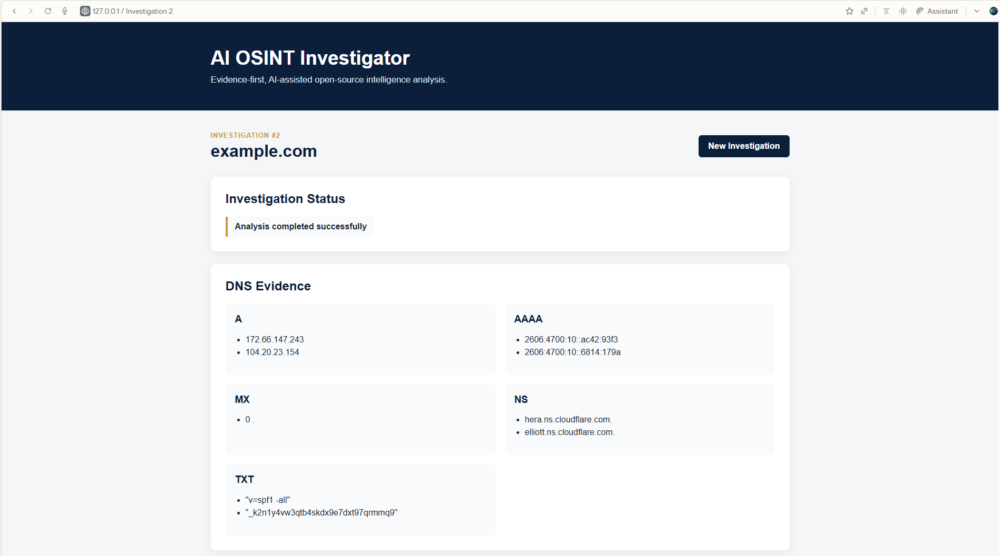

# 🔎 AI OSINT Investigator

[](https://github.com/BecomingCyber/AI-OSINT-INVESTIGATOR/actions/workflows/python-ci.yml)

An evidence-first, AI-assisted open-source intelligence application that collects publicly available information about a domain, structures the evidence, uses AI to assist with analysis, stores investigation results, and generates investigation reports.

> **Workflow:** Collect → Structure → Analyze → Validate → Report

---

## 🖥️ Application Preview



---

## 🧠 Skills Demonstrated

This project demonstrates hands-on experience with:

- Python automation and modular application development
- Open-Source Intelligence (OSINT) collection
- DNS record analysis
- WHOIS analysis
- IP and network infrastructure research
- Passive Certificate Transparency analysis
- HTTP response and security-header analysis
- AI-assisted intelligence analysis
- Evidence validation and analytical reasoning
- Flask web application development
- SQLite database persistence
- PDF investigation reporting
- Git and GitHub version control
- GitHub Actions continuous integration
- API-key and secret management

---

## 📌 Project Overview

AI OSINT Investigator is a cybersecurity portfolio project designed to demonstrate how publicly available technical information can be collected, structured, analyzed, validated, stored, and reported as part of an investigation.

The application accepts a target domain and gathers multiple categories of OSINT, including:

- DNS records
- WHOIS information
- IP information
- Passive subdomain discoveries
- Web technology indicators
- HTTP security headers

Collected evidence is normalized into structured investigation data before being passed to the AI analysis component.

The AI is used as an **analytical assistant rather than an evidence source**. It is instructed to distinguish between:

- Observed facts
- Reasonable inferences
- Unknowns
- Potential risks
- Recommended investigative steps

The analyst remains responsible for validating conclusions.

---

## 🎯 Project Goals

The project was built to practice and demonstrate the ability to:

- Automate repeatable OSINT collection
- Normalize information from multiple public sources
- Correlate domain, DNS, IP, WHOIS, and web evidence
- Integrate AI without treating generated conclusions as facts
- Preserve investigation results for later review
- Present technical findings through a web interface
- Generate investigation reports
- Apply secure API-key management
- Use Git for source control
- Validate application changes through continuous integration

---

## 🏗️ Architecture

```text
                    ┌──────────────────────┐
                    │     Target Domain    │
                    └──────────┬───────────┘
                               │
                               ▼
                    ┌──────────────────────┐
                    │   OSINT Collectors   │
                    └──────────┬───────────┘
                               │
          ┌────────────────────┼────────────────────┐
          │                    │                    │
          ▼                    ▼                    ▼
       DNS/WHOIS            IP Data          Subdomains/Web
          │                    │                    │
          └────────────────────┼────────────────────┘
                               │
                               ▼
                    ┌──────────────────────┐
                    │ Structured Evidence  │
                    └──────────┬───────────┘
                               │
                               ▼
                    ┌──────────────────────┐
                    │ AI-Assisted Analysis │
                    └──────────┬───────────┘
                               │
                               ▼
                    ┌──────────────────────┐
                    │  Analyst Validation  │
                    └──────────┬───────────┘
                               │
                    ┌──────────┴───────────┐
                    ▼                      ▼
             SQLite Database          PDF Report
                    │
                    ▼
             Flask Web Interface
```

---

## 🔍 Investigation Workflow

### 1. Collect

The application collects publicly available technical information about the target domain.

### 2. Structure

Results from the individual collectors are organized into a consistent investigation data structure.

### 3. Analyze

Structured evidence is provided to the AI analysis component.

### 4. Validate

AI-generated observations are treated as analytical leads that require human review.

### 5. Report

Investigation results can be stored in SQLite, viewed through the Flask interface, and incorporated into an investigation report.

```text
Collect
   ↓
Structure
   ↓
Analyze
   ↓
Validate
   ↓
Report
```

---

## 🔎 OSINT Collection

### DNS

The DNS collector retrieves common records such as:

- A
- AAAA
- MX
- NS
- TXT

These records can provide information about network infrastructure, mail configuration, nameservers, and other domain characteristics.

### WHOIS

WHOIS data may provide information such as:

- Registrar
- Creation date
- Expiration date
- Update date
- Nameservers
- Domain status

WHOIS results vary because registration information may be redacted or represented differently by different registries.

### IP Information

The application resolves the target domain and gathers public information associated with the resolved IP address.

Possible evidence includes:

- IP address
- Hostname
- Network organization
- Region
- Country
- Time zone

> IP geolocation is treated as approximate infrastructure information and not proof of an organization's physical location.

### Passive Subdomain Discovery

Subdomains are collected passively using publicly available Certificate Transparency information.

The collector validates domain boundaries to prevent unrelated domains from being incorrectly classified as subdomains.

For example:

```text
www.example.com       → Valid
support.example.com   → Valid
m.testexample.com     → Rejected
```

> Certificate Transparency records indicate that a hostname appeared in certificate data. They do not prove that the hostname is currently active.

### Web Technology Evidence

The application also examines publicly observable web characteristics, including technology indicators and HTTP response information.

### HTTP Security Headers

HTTP headers may provide evidence about defensive web configuration.

The application treats missing headers as **observations requiring context**, not automatic proof of a vulnerability.

---

## 🤖 AI-Assisted Analysis

The AI component receives structured OSINT evidence and is instructed to analyze only the information provided.

The analysis focuses on:

1. Summarizing collected evidence
2. Identifying relationships between findings
3. Highlighting observations requiring further investigation
4. Identifying potential risks when supported by evidence
5. Distinguishing facts from assumptions
6. Avoiding unsupported malicious classifications
7. Recommending reasonable investigative next steps

### Human-in-the-Loop Principle

```text
Collected Evidence
        ↓
AI Analysis
        ↓
Potential Findings
        ↓
Human Validation
        ↓
Investigation Conclusion
```

AI output is **not treated as evidence by itself**.

---

## ⚙️ Key Technical Decisions

Several design decisions were made intentionally:

### Passive collection over intrusive scanning

Certificate Transparency information is used for passive subdomain discovery rather than brute-force enumeration.

### Evidence separated from analysis

Raw collected evidence is preserved separately from AI-generated interpretation so findings can be independently reviewed.

### Structured investigation data

Collector results are normalized into structured data before analysis, storage, or reporting.

### Evidence-grounded AI prompting

The AI is explicitly instructed to separate facts, inferences, unknowns, risks, and investigative recommendations.

### Local investigation persistence

SQLite provides lightweight persistence without requiring an external database service.

### Secret isolation

API credentials are stored in a local `.env` file that is excluded from Git. A `.env.example` file documents required variables without exposing credentials.

---

## 🗂️ Project Structure

```text
AI-OSINT-INVESTIGATOR/
│
├── .github/
│   └── workflows/
│       └── python-ci.yml
│
├── analyzer/
│   └── ai_analyzer.py
│
├── collectors/
│   ├── dns_collector.py
│   ├── ip_collector.py
│   ├── subdomain_collector.py
│   ├── technology_collector.py
│   └── whois_collector.py
│
├── database/
│   └── database_manager.py
│
├── reporting/
│   └── pdf_report.py
│
├── screenshots/
│
├── scripts/
│   ├── init_db.py
│   ├── investigate.py
│   └── retrieve_investigation.py
│
├── static/
│   └── style.css
│
├── templates/
│   ├── history.html
│   ├── index.html
│   └── results.html
│
├── .env.example
├── .gitignore
├── app.py
├── README.md
└── requirements.txt
```

---

## 🛠️ Technologies Used

| Technology | Purpose |
|---|---|
| Python | Core application and automation |
| Flask | Web application |
| SQLite | Investigation persistence |
| dnspython | DNS collection |
| python-whois | WHOIS collection |
| Requests | HTTP/API communication |
| OpenAI API | AI-assisted analysis |
| ReportLab | PDF report generation |
| HTML/CSS | Investigation interface |
| Git | Version control |
| GitHub | Repository hosting |
| GitHub Actions | Continuous integration |

---

## 🚀 Installation

### 1. Clone the repository

```bash
git clone https://github.com/BecomingCyber/AI-OSINT-INVESTIGATOR.git
cd AI-OSINT-INVESTIGATOR
```

### 2. Create a virtual environment

Windows:

```powershell
python -m venv venv
.\venv\Scripts\Activate.ps1
```

Linux/macOS:

```bash
python3 -m venv venv
source venv/bin/activate
```

### 3. Install dependencies

```bash
pip install -r requirements.txt
```

### 4. Configure environment variables

Copy:

```text
.env.example
```

to:

```text
.env
```

Then configure the required API credentials.

Example:

```text
OPENAI_API_KEY=
SHODAN_API_KEY=
VIRUSTOTAL_API_KEY=
```

> Never commit `.env` or API credentials to source control.

### 5. Initialize the database

```bash
python scripts/init_db.py
```

### 6. Run the Flask application

```bash
python app.py
```

Open:

```text
http://127.0.0.1:5000
```

---

## 🖥️ Application Features

The Flask interface provides:

- New domain investigation
- Structured OSINT results
- DNS evidence
- WHOIS evidence
- IP information
- Passive subdomain results
- Technology evidence
- AI-assisted analysis
- Investigation status
- Investigation history
- Previously stored investigation retrieval

---

## 💾 Investigation Persistence

Investigation results are stored locally using SQLite.

This allows investigations to be:

```text
Run Investigation
       ↓
Collect Evidence
       ↓
Analyze Evidence
       ↓
Save Investigation
       ↓
Retrieve Later
```

Persistence makes it possible to review previous findings rather than treating each investigation as a temporary terminal session.

---

## 📄 Investigation Reporting

The reporting component generates PDF investigation reports from structured investigation results.

The reporting workflow separates:

- Collected evidence
- AI-assisted observations
- Investigation metadata
- Analytical findings

This supports a more realistic cybersecurity investigation workflow where evidence must remain reviewable after analysis.

---

## 🧪 Continuous Integration

This repository uses **GitHub Actions** to automatically validate the project whenever changes are pushed to `main` or submitted through a pull request.

Current CI checks include:

- Dependency installation
- Python source compilation
- Flask application import validation

```text
Code Change
     ↓
Git Push
     ↓
GitHub Actions
     ↓
Install Dependencies
     ↓
Compile Python
     ↓
Validate Flask Import
     ↓
🟢 Pass / 🔴 Fail
```

The current workflow status is displayed at the top of this README.

---

## 📸 Development Evidence

The `screenshots/` directory documents major development milestones, including:

1. Project setup
2. DNS collector testing
3. WHOIS collector testing
4. IP collector testing
5. Combined OSINT collection
6. AI analysis
7. End-to-end investigation
8. Technology evidence integration
9. Database persistence
10. Investigation retrieval
11. Flask web interface
12. Web investigation results
13. Investigation history
14. GitHub Actions CI validation

These screenshots document the progression from individual collectors to an integrated investigation platform.

---

## 🔐 Security Considerations

Security was incorporated into the project workflow rather than added only at the end.

### API keys

Sensitive credentials are stored in:

```text
.env
```

The `.env` file is excluded through `.gitignore`.

Only placeholder variable names are included in:

```text
.env.example
```

### Secret validation

Repository contents were checked before the initial public push to reduce the risk of accidentally committing API credentials.

### Evidence integrity

AI-generated statements are kept conceptually separate from collected OSINT evidence.

### Collection scope

The project focuses on publicly available and passive information rather than intrusive exploitation or unauthorized access.

---

## ⚖️ Responsible Use

This project is intended for:

- Cybersecurity education
- Defensive OSINT
- Authorized security research
- Threat intelligence learning
- Portfolio development
- Investigation of systems or domains where the analyst has appropriate authorization

Users are responsible for ensuring that their investigations comply with applicable laws, policies, authorization requirements, and terms of service.

The project is not intended for unauthorized access, exploitation, harassment, or intrusive surveillance.

---

## 💡 Lessons Learned

Building this project reinforced several important cybersecurity principles.

### Collection is not analysis

A DNS record, certificate entry, WHOIS value, or HTTP header is an observation. Its meaning depends on context.

### Correlation increases value

Individual OSINT artifacts become more useful when relationships between DNS, WHOIS, IP, subdomain, and web evidence are examined together.

### AI requires evidence boundaries

AI can help identify patterns and summarize complex information, but generated conclusions must remain distinguishable from observed evidence.

### Validation matters

A technically correct script can still produce misleading results if its input validation or domain-boundary logic is weak.

### Documentation is part of the investigation

Screenshots, structured evidence, reports, and saved investigations make technical work reproducible and reviewable.

### Security includes development practices

Secret management, version control, and automated validation are part of building security tooling responsibly.

---

## 🔮 Future Improvements

Planned improvements include:

- Automated unit and integration tests
- Mocked AI/API tests
- Additional collector error handling
- Improved evidence normalization
- Investigation export options
- Additional passive intelligence sources
- More detailed report customization
- Search and filtering of investigation history
- Improved input validation
- Additional analytical correlation rules

### Planned Test Suite

A future `tests/` directory will validate behavior such as:

```text
tests/
├── test_collectors.py
├── test_database.py
└── test_flask_routes.py
```

Examples include:

- Database save and retrieval
- Flask route response validation
- Invalid investigation handling
- Subdomain boundary validation
- Collector error handling

External AI calls should be mocked during automated testing to avoid exposing credentials or generating unnecessary API usage.

---

## 🎓 Portfolio Focus

This project demonstrates practical skills relevant to roles such as:

- SOC Analyst
- Cybersecurity Analyst
- Digital Forensics / DFIR Analyst
- Incident Response Analyst
- Threat Intelligence Analyst
- Security Automation Analyst

The goal is not simply to demonstrate that Python scripts can retrieve information.

The project demonstrates the broader investigative process:

> **Collect evidence → organize it → analyze it → validate conclusions → preserve results → communicate findings.**

---

## 👤 Author

**BecomingCyber**

Cybersecurity • Digital Forensics • OSINT • Security Automation

Built as part of an ongoing cybersecurity portfolio focused on developing practical skills and documenting proof of work.

---

## 📜 Disclaimer

This project is provided for educational and authorized security-research purposes. Information generated by the application, including AI-assisted analysis, should be independently validated before being used to make security, investigative, or operational decisions.
